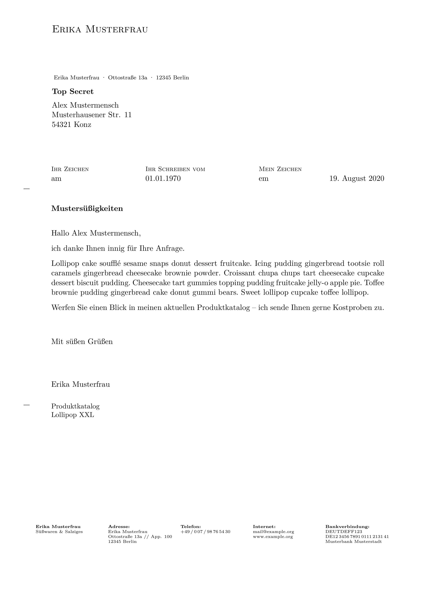

# Pandoc LaTeX g-brief2 Template

## Description

This template can be used to create a letter based on the LaTeX document class `g-brief2` by Michael Lenzen.
It basically wraps the important commands to Pandoc's metadata (YAML).
In addition to the original LaTeX template you can also modify some field names.

## Requirements

* [Pandoc](https://pandoc.org/)
* [LaTeX](https://www.latex-project.org/)
* [g-brief – Letter document class](https://ctan.org/pkg/g-brief)

Move the [LaTeX template file](./g-brief2.latex)
into your Pandoc template directory, e.g.:

```sh
mkdir -p ~/.pandoc/templates
wget https://raw.githubusercontent.com/winkelband/pandoc-latex-g-brief2/master/g-brief2.latex -P ~/.pandoc/templates/
```

Compile your letter written in Markdown
into PDF with the following command:

`pandoc --standalone --template g-brief2 --pdf-engine xelatex --from markdown letter.md -o letter.pdf`

## Example

A letter written in Markdown can be simple as:

```yaml
---
author: Erika Musterfrau
internet:
  line1: mail@example.org
return-address-envelope:  
  - Erika Musterfrau
  - Ottostraße 13a
  - 12345 Berlin
address:
  - Alex Mustermensch
  - Musterhausener Str. 11
  - 54321 Konz

subject: Mustersüßigkeiten

opening: Hallo Alex Mustermensch,
closing: Mit süßen Grüßen
...

ich danke Ihnen innig für Ihre Anfrage.
Lollipop cake soufflé sesame snaps donut dessert fruitcake.

Werfen Sie einen Blick in meinen aktuellen Produktkatalog –
ich sende Ihnen gerne Kostproben zu.
```

For a more comprehensive example look into [example/letter.md](./example/letter.md).



## Options for Pandoc header

The following YAML variables (strings, lists, dictionaries) can be used by this template.

```yaml
fontsize: # 10pt, 11pt (default), 12pt
author: # string # Used in header and as signature.
name: # Your name with additional information (will be printed in the footer).
  line1: # string
  line3: 
  line2: 
  line4: 
  line5: 
  line6: 
  line7:
postalnote: # string
address: # Address of the recipient.
  - # string
cc: # Additional recipients (names).
  - # string
return-address-envelope: # Keep the lines short (get concatenated with "·").
  - # string
return-address-footer: # Address in the footer. Can hold more information than address bar in envelope.
  line1: # string
  line3: 
  line2: 
  line4: 
  line5: 
  line6: 
phone:
  line1: # string
  line3: 
  line2: 
  line4: 
  line5: 
  line6: 
internet:
  line1: # string
  line3: 
  line2: 
  line4: 
  line5: 
  line6: 
banking:
  line1: # string
  line3: 
  line2: 
  line4: 
  line5: 
  line6: 
recipient-refsign:
  field: # string
  value: # string (default: "Ihr Zeichen") 
recipient-letter:
  field: # string
  value: # string (default "Ihr Schreiben vom")
sender-refsign:
  field: # string
  value: # string (default: "Mein Zeichen")

date: # string or command (e.g. \today)
title: # string

opening: # string
closing: # string

trendlines: # bool (default: false)
envelopemarks: # bool (default: false)
foldmarks: # bool (default: false)
punchmark: # bool (default: false)

lang: # using code according to [IETF BCP 47 tags](https://tools.ietf.org/html/bcp47)
otherlangs: # multiple dictionaries

title-meta: # string (when title omitted)
author-meta: # string (when author omitted)
subject: # string
keywords: # list
```
